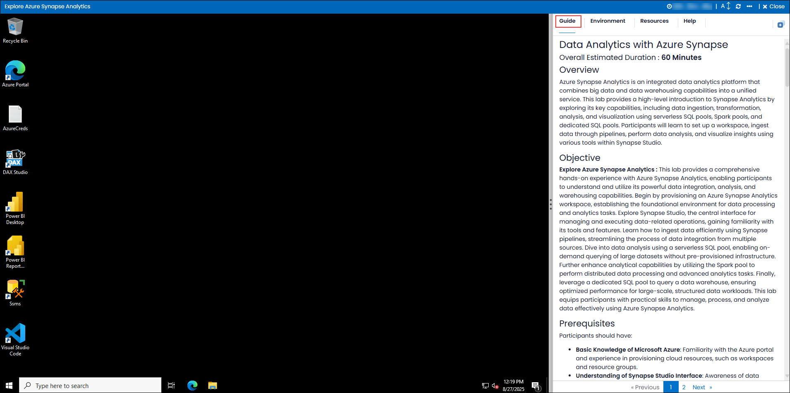

# Data Analytics with Azure Synapse 

### Overall Estimated Duration : **90 Minutes**

## Overview
Azure Synapse Analytics is an integrated data analytics platform that combines big data and data warehousing capabilities into a unified service. This lab provides a high-level introduction to Synapse Analytics by exploring its key capabilities, including data ingestion, transformation, analysis, and visualization using serverless SQL pools, Spark pools, and dedicated SQL pools. Participants will learn to set up a workspace, ingest data through pipelines, perform data analysis, and visualize insights using various tools within Synapse Studio.

## Objective

**Explore Azure Synapse Analytics :** This lab provides a comprehensive hands-on experience with Azure Synapse Analytics, enabling participants to understand and utilize its powerful data integration, analysis, and warehousing capabilities. Begin by provisioning an Azure Synapse Analytics workspace, establishing the foundational environment for data processing and analytics tasks. Explore Synapse Studio, the central interface for managing and executing data-related operations, gaining familiarity with its tools and features. Learn how to ingest data efficiently using Synapse pipelines, streamlining the process of data integration from multiple sources. Dive into data analysis using a serverless SQL pool, enabling on-demand querying of large datasets without pre-provisioned infrastructure. Further enhance analytical capabilities by utilizing the Spark pool to perform distributed data processing and advanced analytics tasks. Finally, leverage a dedicated SQL pool to query a data warehouse, ensuring optimized performance for large-scale, structured data workloads. This lab equips participants with practical skills to manage, process, and analyze data effectively using Azure Synapse Analytics.

## Prerequisites

Participants should have:

- **Basic Knowledge of Microsoft Azure**: Familiarity with the Azure portal and experience in provisioning cloud resources, such as workspaces and resource groups.  
- **Understanding of Synapse Studio Interface**: Awareness of data analytics interfaces and basic navigation skills within cloud-based data platforms.  
- **Basic Data Ingestion Concepts**: Understanding data ingestion pipelines and their role in transferring and processing data across cloud services.  
- **SQL Querying Skills**: Basic knowledge of SQL syntax for querying and analyzing data in relational databases and data warehouses.  
- **Fundamentals of Spark Analytics**: Familiarity with distributed data processing frameworks like Apache Spark for performing large-scale data analysis.  
- **Understanding of Data Warehousing Concepts**: Awareness of data warehousing principles, including structured data storage, indexing, and querying for optimized performance.  

## Architecture 
The lab architecture follows a structured flow designed to guide participants through key components and functionalities of **Azure Synapse Analytics**. The process begins with **creating and provisioning an Azure Synapse Analytics workspace**, providing a central hub for managing data and analytics workloads. Participants then explore **Synapse Studio**, an integrated interface for performing data engineering, data science, and analytics tasks. **data ingestion pipelines** are created to move and transform data, ensuring datasets are properly prepared for analysis. The lab utilizes **Serverless SQL Pools** for on-demand querying of data stored in data lakes, enabling efficient, pay-per-query analysis. In parallel, **Spark Pools** are used for distributed data processing and advanced analytics on large datasets.**Dedicated SQL Pools** enable structured data warehousing, optimized for performance and scalability, allowing participants to query and analyze large datasets efficiently.

## Architecture Diagram

  

## Explanation of Components

The architecture for this lab involves the following key components: 
- **Azure Synapse Analytics Workspace:** Acts as the central environment for managing and organizing resources, data pipelines, and analytical workloads.  

- **Synapse Studio:** A unified platform for data integration, data exploration, and advanced analytics, providing tools for SQL, Spark, and data pipelines.  

- **Data Ingestion Pipeline:** Facilitates data movement and transformation, ensuring data flows seamlessly into the analytics platform for further processing.  

- **Serverless SQL Pool:** Enables ad-hoc querying and analysis of data stored in Azure Data Lake without requiring infrastructure setup.  

- **Spark Pool:** Provides distributed data processing capabilities, allowing large-scale data analytics and advanced machine learning workflows.  

- **Dedicated SQL Pool:** Acts as a traditional data warehouse within Azure Synapse, offering optimized performance for structured querying and reporting.

## Getting Started with the Lab 

Once you're ready to dive in, your virtual machine and lab guide will be right at your fingertips within your web browser.

### Virtual Machine & Lab Guide
 
Your virtual machine is your workhorse throughout the workshop. The lab guide is your roadmap to success. 

**Note**: Kindly ensure that you are following the instructions carefully to ensure the lab runs smoothly and provides an optimal user experience.
 
## Exploring Your Lab Resources
 
To get a better understanding of your lab resources and credentials, navigate to the **Environment** details tab.
 

 
## Utilizing the Split Window Feature
 
For convenience, you can open the lab guide in a separate window by selecting the **Split Window** button from the Top right corner.
 
 

## Lab Guide Zoom In/Zoom Out
 
To adjust the zoom level for the environment page, click the **A↕** icon located next to the timer in the lab environment.

 
## Managing Your Virtual Machine
 
Feel free to start, stop, or restart your virtual machine as needed from the **Resources** tab. Your experience is in your hands!
 

## Let's Get Started with Azure Portal
 
1. On your virtual machine, click on the Azure Portal icon as shown below:
 
   .png)

2. You'll see the **Sign into Microsoft Azure** tab. Here, enter your credentials:
 
   - **Email/Username:** <inject key="AzureAdUserEmail"></inject>
 
       
 
3. Next, provide your password:
 
   - **Password:** <inject key="AzureAdUserPassword"></inject>
 
      

1. If you see the pop-up **Action Required**, click **Ask Later**.

   

    >**NOTE:** Do not enable MFA, select **Ask Later**.
     
4. If prompted to stay signed in, you can click "No."
 
5. If a **Welcome to Microsoft Azure** pop-up window appears, simply click "Cancel" to skip the tour.
  
## Support Contact
 
The CloudLabs support team is available 24/7, 365 days a year, via email and live chat to ensure seamless assistance at any time. We offer dedicated support channels tailored specifically for both learners and instructors, ensuring that all your needs are promptly and efficiently addressed.

Learner Support Contacts:
- Email Support: cloudlabs-support@spektrasystems.com
- Live Chat Support: https://cloudlabs.ai/labs-support

Now, click on **Next** from the lower right corner to move on to the next page.

  .png)

### Happy Learning!!
