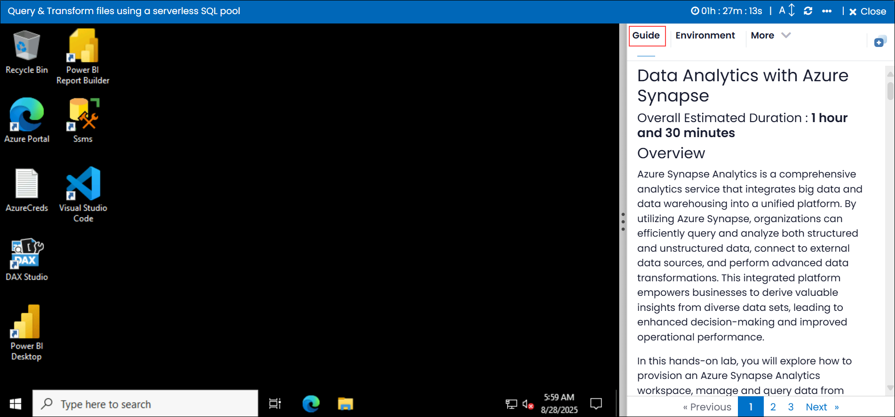

# Data Analytics with Azure Synapse 

### Overall Estimated Duration : **1 hour and 30 minutes**

## Overview

Azure Synapse Analytics is a comprehensive analytics service that integrates big data and data warehousing into a unified platform. By utilizing Azure Synapse, organizations can efficiently query and analyze both structured and unstructured data, connect to external data sources, and perform advanced data transformations. This integrated platform empowers businesses to derive valuable insights from diverse data sets, leading to enhanced decision-making and improved operational performance.

In this hands-on lab, you will explore how to provision an Azure Synapse Analytics workspace, manage and query data from various sources, and visualize and transform data for deeper insights. You will gain the skills necessary to interact with both internal and external data, optimize data workflows, and apply transformation logic to generate actionable outcomes that support business objectives.

## Objective

Learn to leverage Azure Synapse Analytics and its serverless SQL pool to query and transform data efficiently, gaining insights and optimizing workflows. This experience will guide you through the process of provisioning a Synapse workspace, querying various file formats, and applying transformation logic to streamline data processing.

**Query Files Using a Serverless SQL Pool**: Learn how to provision an Azure Synapse Analytics workspace and query data from files stored in the data lake using serverless SQL pools. You will explore querying different file formats, including CSV, Parquet, and JSON, to efficiently access and analyze data. Additionally, you will work with external data sources in a database and visualize the results to gain actionable insights.

**Transform Files Using a Serverless SQL Pool**: Learn how to transform data using serverless SQL pools by applying CREATE EXTERNAL TABLE AS SELECT (CETAS) statements to process and store transformed data. You will also encapsulate data transformations into stored procedures to automate and optimize your workflows. This will help streamline data processing and improve the efficiency of your data management tasks. 

## Prerequisites 

Participants should have:
- **Basic Knowledge of Microsoft Azure**: Familiarity with the Azure portal and experience in provisioning cloud resources, such as workspaces, storage accounts, and resource groups, to set up the necessary environment for data analytics.
  
- **Understanding of Azure Synapse Analytics**: Familiarity with the core components of Azure Synapse Analytics, including its workspace, serverless SQL pool, and integration with Azure Data Lake for querying and managing data.

- **SQL Querying Skills**: Proficiency in basic SQL syntax for querying and analyzing data. Participants should be able to write queries to retrieve, filter, and aggregate data, as well as query different file formats like CSV, Parquet, and JSON in a cloud-based SQL environment.

- **Experience with Data Lake and External Data Sources**: Understanding of data lake storage and external data sources, as well as familiarity with tools like PolyBase and OPENROWSET for querying external data from various sources.

- **Basic Data Transformation Concepts**: Understanding the process of transforming data using SQL-based operations, including data manipulation and using CREATE EXTERNAL TABLE AS SELECT (CETAS) statements for transforming and storing data in external tables.

- **Understanding of Data Visualization**: Basic knowledge of visualizing query results and creating reports using charting tools, particularly within the Synapse Studio environment.

## Architecture
The architecture leverages Azure Synapse Analytics to create an efficient environment for querying, transforming, and analyzing data using serverless SQL pools. The second lab focuses on setting up a Synapse Analytics workspace, querying external data stored in services like Azure Data Lake, and visualizing query results to derive insights. This ensures a smooth transition from data storage to analysis. The third lab builds on this by adding advanced transformation capabilities. It begins with workspace provisioning and data querying, followed by using CETAS statements to structure datasets efficiently. Finally, transformation logic is encapsulated in stored procedures to automate workflows and enhance data processing. This approach streamlines the process from raw data querying to reusable and structured transformations.

## Architecture Diagram

## Explanation of Components

### Lab 02 Components:

- **Azure Synapse Analytics Workspace:** A central hub for managing data queries, analysis, and visualization, enabling seamless interaction with both internal and external data sources.
- **Serverless SQL Pool:** A scalable query engine that allows running SQL queries directly on data files in Azure Data Lake, without requiring the provisioning of dedicated infrastructure.
- **Data Lake or External Storage:** A repository, often Azure Data Lake, where large datasets such as CSV, JSON, or Parquet files are stored and accessed for querying and analysis.
- **Visualization Tools:** Integrated tools within Synapse Studio or external platforms like Power BI to visualize query results, facilitating the creation of interactive reports and dashboards for business insights.

### Lab 03 Components:

- **Azure Synapse Analytics Workspace:** A unified environment for data transformation, querying, and analysis, where users can manage both structured and unstructured data workflows.
- **CETAS (Create External Table As Select):** A SQL statement used to transform data and store the results as external tables in the data lake, enabling efficient data reuse and further analysis.
- **Azure Data Lake Storage:** A scalable storage solution that holds both raw and transformed data. In this lab, transformed datasets are stored as external tables in the data lake for easy access.
- **Stored Procedures:** Reusable SQL scripts that encapsulate data transformation logic, automating and standardizing the transformation process for consistent execution across multiple workflows.

## Getting Started with the Lab 

Once you're ready to dive in, your virtual machine and lab guide will be right at your fingertips within your web browser.
 

### Virtual Machine & Lab Guide
 
Your virtual machine is your workhorse throughout the workshop. The lab guide is your roadmap to success. 

**Note**: Kindly ensure that you are following the instructions carefully to ensure the lab runs smoothly and provides an optimal user experience.
 
## Exploring Your Lab Resources
 
To get a better understanding of your lab resources and credentials, navigate to the **Environment** details tab.
 

 
## Utilizing the Split Window Feature
 
For convenience, you can open the lab guide in a separate window by selecting the **Split Window** button from the Top right corner.
 
 

## Lab Guide Zoom In/Zoom Out
 
To adjust the zoom level for the environment page, click the **A↕** icon located next to the timer in the lab environment.

 
## Managing Your Virtual Machine
 
Feel free to start, stop, or restart your virtual machine as needed from the **Resources** tab. Your experience is in your hands!
 

## Let's Get Started with Azure Portal
 
1. On your virtual machine, click on the Azure Portal icon as shown below:
 
   .png)

2. You'll see the **Sign into Microsoft Azure** tab. Here, enter your credentials:
 
   - **Email/Username:** <inject key="AzureAdUserEmail"></inject>
 
       
 
3. Next, provide your password:
 
   - **Password:** <inject key="AzureAdUserPassword"></inject>
 
      

1. If you see the pop-up **Action Required**, click **Ask Later**.

   

    >**NOTE:** Do not enable MFA, select **Ask Later**.
     
4. If prompted to stay signed in, you can click "No."
 
5. If a **Welcome to Microsoft Azure** pop-up window appears, simply click "Cancel" to skip the tour.
  
## Support Contact
 
The CloudLabs support team is available 24/7, 365 days a year, via email and live chat to ensure seamless assistance at any time. We offer dedicated support channels tailored specifically for both learners and instructors, ensuring that all your needs are promptly and efficiently addressed.

Learner Support Contacts:
- Email Support: cloudlabs-support@spektrasystems.com
- Live Chat Support: https://cloudlabs.ai/labs-support

Now, click on **Next** from the lower right corner to move on to the next page.

  .png)

### Happy Learning!!
