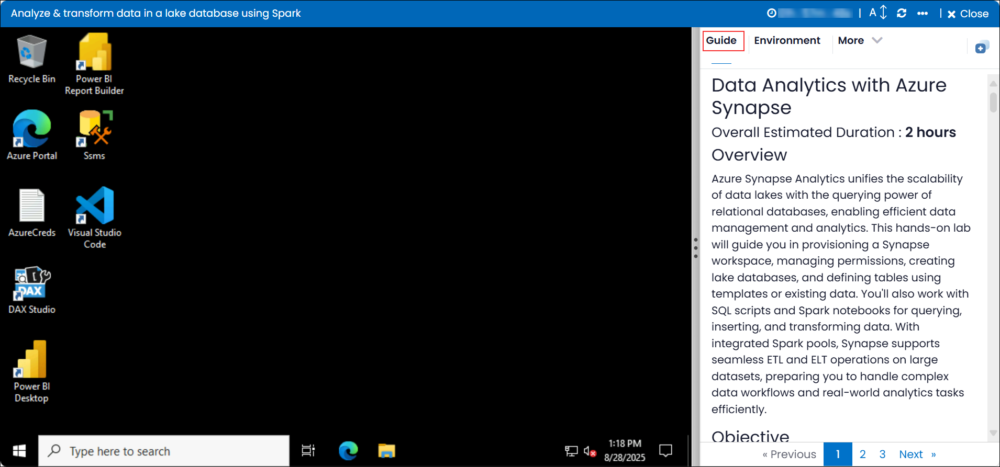

# Data Analytics with Azure Synapse 

### Overall Estimated Duration : **2 hours**

## Overview
Azure Synapse Analytics unifies the scalability of data lakes with the querying power of relational databases, enabling efficient data management and analytics. This hands-on lab will guide you in provisioning a Synapse workspace, managing permissions, creating lake databases, and defining tables using templates or existing data. You'll also work with SQL scripts and Spark notebooks for querying, inserting, and transforming data. With integrated Spark pools, Synapse supports seamless ETL and ELT operations on large datasets, preparing you to handle complex data workflows and real-world analytics tasks efficiently.

## Objective 
Learn to provision and configure an Azure Synapse Analytics workspace with integrated Spark pool capabilities, create and manage lake databases, and utilize Spark notebooks to perform ETL and ELT operations, enabling efficient data transformation, management, and analysis within a unified Synapse environment. 

**Analyze data in a lake database:** Participants will learn to provision an Azure Synapse Analytics workspace and configure it to support lake databases. The lab will guide them through modifying container permissions to ensure secure access to data. Participants will create a lake database in Synapse Studio, applying a structured relational schema on top of data stored in a data lake. Additionally, they will gain hands-on experience creating tables from both templates and existing data. By working with lake database tables using SQL and Spark, participants will gain the skills needed to effectively manage and analyze data in a lake database environment.

**Transform data using Spark in Synapse Analytics:** Learn to provision and configure an Azure Synapse Analytics workspace with integrated Spark pool capabilities, enabling seamless data transformation workflows. Gain hands-on experience in setting up the workspace, ensuring proper access control, and leveraging Spark notebooks to perform ETL (Extract, Transform, Load) and ELT (Extract, Load, Transform) operations on large datasets. Explore the process of importing and running Spark notebooks, configuring storage access permissions, and executing transformation tasks to prepare data for downstream analytics. This lab equips participants with the foundational skills required to handle data engineering tasks efficiently within the Azure Synapse Analytics environment.

## Prerequisites

Participants should have: 
- **Basic Knowledge of Azure Synapse Analytics**: Familiarity with the Azure Synapse platform, including workspace provisioning and data storage integration.
- **SQL Querying Skills**: Experience in writing and executing SQL queries, including data manipulation and retrieval.
- **Understanding of Data Lake Concepts**: Knowledge of data lake storage, file formats (such as CSV, Parquet, and JSON), and their usage for data storage.
- **Basic Understanding of Azure Data Lake Storage**: Familiarity with Azure Data Lake Storage and its integration with Azure Synapse Analytics for data querying and processing.
- **Experience with Data Modeling**: Understanding of how to design and create tables and databases, including working with relational data models.  
- **Familiarity with Spark**: Knowledge of how Spark pools are used for large-scale data processing.  
- **Data Transformation Concepts**: Experience with transforming datasets from one format to another using Spark or similar frameworks.  
- **Basic Understanding of Notebooks**: Ability to work with Jupyter-style notebooks, specifically for performing data transformation tasks.  
- **Basic SQL and Data Querying Skills**: Ability to query data from files and perform transformations on it using SQL or Spark-based languages.

## Architecture

The architecture starts with provisioning an Azure Synapse Analytics workspace, enabling big data analytics and data warehousing. Secure access is granted to the storage container, followed by the creation of a lake database to efficiently manage structured data. Users can create tables either manually, using templates, or from existing data.  For advanced data transformations, Spark pools are integrated into the workspace. Using Spark notebooks, users perform ETL/ELT processes to convert raw data into structured formats, supporting efficient and scalable data transformation pipelines. This setup combines data management with powerful transformation capabilities within Azure Synapse Analytics.

## Architecture Diagram 

## Explanation of Components

### Lab 04 Components:
- **Azure Synapse Analytics Workspace:** Provides an environment for managing data and analytics workloads. It is used to provision the workspace, create a lake database, and work with lake database tables.

- **Azure Storage Container Permissions:** Ensures secure access and proper configuration of data stored in Azure Data Lake Storage, enabling interaction with the lake database.

- **Lake Database:** Acts as a structured data repository within the Synapse workspace, supporting table creation and data analysis.

- **Table Creation Methods:** 
  - **Manual Creation:** Define tables directly within the lake database.
  - **Using Templates:** Generate tables with predefined schemas.
  - **From Existing Data:** Map tables to external data sources dynamically.
 
### Lab 05 Components:

- **Azure Synapse Analytics Workspace:** Acts as the central platform for managing data engineering tasks, integrating data lakes, Spark pools, and analytics tools in a unified environment.

- **Spark Pool:** Provides a scalable and distributed processing engine, enabling efficient execution of Spark notebooks for large-scale data transformations.

- **Data Files in Azure Data Lake:** Source files (e.g., CSV, Parquet) stored in Azure Data Lake are accessed and processed during the transformation workflow.

- **Spark Notebook:** Serves as the interactive interface to write and execute code for data transformation, enabling complex ETL and ELT operations.
  
## Getting Started with the Lab 

Once you're ready to dive in, your virtual machine and lab guide will be right at your fingertips within your web browser.
 

### Virtual Machine & Lab Guide
 
Your virtual machine is your workhorse throughout the workshop. The lab guide is your roadmap to success. 

**Note**: Kindly ensure that you are following the instructions carefully to ensure the lab runs smoothly and provides an optimal user experience.
 
## Exploring Your Lab Resources
 
To get a better understanding of your lab resources and credentials, navigate to the **Environment** details tab.
 

 
## Utilizing the Split Window Feature
 
For convenience, you can open the lab guide in a separate window by selecting the **Split Window** button from the Top right corner.
 
 

## Lab Guide Zoom In/Zoom Out
 
To adjust the zoom level for the environment page, click the **A↕** icon located next to the timer in the lab environment.

 
## Managing Your Virtual Machine
 
Feel free to start, stop, or restart your virtual machine as needed from the **Resources** tab. Your experience is in your hands!
 

## Let's Get Started with Azure Portal
 
1. On your virtual machine, click on the Azure Portal icon as shown below:
 
   .png)

2. You'll see the **Sign into Microsoft Azure** tab. Here, enter your credentials:
 
   - **Email/Username:** <inject key="AzureAdUserEmail"></inject>
 
       
 
3. Next, provide your password:
 
   - **Password:** <inject key="AzureAdUserPassword"></inject>
 
      

1. If you see the pop-up **Action Required**, click **Ask Later**.

   

    >**NOTE:** Do not enable MFA, select **Ask Later**.
     
4. If prompted to stay signed in, you can click "No."
 
5. If a **Welcome to Microsoft Azure** pop-up window appears, simply click "Cancel" to skip the tour.
  
## Support Contact
 
The CloudLabs support team is available 24/7, 365 days a year, via email and live chat to ensure seamless assistance at any time. We offer dedicated support channels tailored specifically for both learners and instructors, ensuring that all your needs are promptly and efficiently addressed.

Learner Support Contacts:
- Email Support: cloudlabs-support@spektrasystems.com
- Live Chat Support: https://cloudlabs.ai/labs-support

Now, click on **Next** from the lower right corner to move on to the next page.

  .png)

### Happy Learning!!