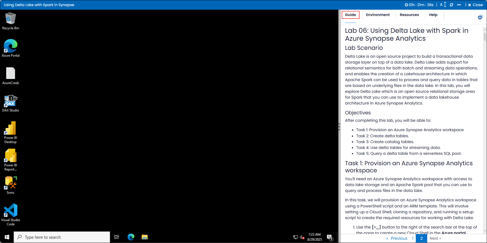

# Data Analytics with Azure Synapse 

### Overall Estimated Duration : **90 minutes**

## Overview 

**Azure Synapse Analytics** and **Delta Lake** offer a unified platform for managing and analyzing large-scale data. Azure Synapse integrates big data and data warehousing, while Delta Lake provides reliable, scalable storage with features like ACID transactions and time travel.

In this hands-on experience, you will explore how to use **Azure Synapse** with **Delta Lake** to efficiently store and process data. You will set up a Synapse workspace, connect it to Delta Lake, and work with Delta tables using Apache Spark. You'll also explore batch and stream processing, along with Delta Lake's time travel features to analyze historical data.

## Objective  

**Using Delta Lake with Spark in Azure Synapse Analytics**: This lab provides an in-depth, hands-on experience with Delta Lake and Apache Spark within Azure Synapse Analytics, enabling participants to master the integration of these tools for scalable data processing. The journey begins with provisioning an Azure Synapse Analytics workspace, which lays the foundation for effective data management and analysis. Participants will learn to create Delta tables, a core component of Delta Lake, for storing and managing structured data. The lab will then guide you through the process of creating catalog tables to organize and access data efficiently. The next task focuses on utilizing Delta tables for streaming data, demonstrating how to process and analyze real-time data streams within Synapse. Finally, you will explore querying Delta tables from a serverless SQL pool, allowing you to execute SQL queries on large datasets without the need for dedicated infrastructure. 

## Prerequisites 

Participants should have:

- **Basic Knowledge of Microsoft Azure**: Familiarity with the Azure portal and experience in provisioning cloud resources, such as workspaces and resource groups.
  
- **Understanding of Synapse Studio Interface**: Awareness of data analytics interfaces and basic navigation skills within cloud-based data platforms.

- **Basic SQL Querying Skills**: Knowledge of SQL syntax to create and query tables in a SQL-based environment, including querying Delta tables in serverless SQL pools.

- **Familiarity with Delta Tables**: Understanding of Delta Lake and how to create and work with Delta tables in a Spark environment.

- **Knowledge of Streaming Data Concepts**: Awareness of how streaming data can be ingested and processed using Delta tables.

## Architecture

The lab architecture provides a hands-on experience with Delta Lake and Azure Synapse Analytics. It starts with provisioning an Azure Synapse Analytics workspace, which serves as the foundation for managing resources. Participants will then create Delta tables for efficient data storage and retrieval, supporting both batch and streaming data. Next, catalog tables are created within Delta Lake to manage metadata and facilitate organized querying of Delta tables. The lab also explores streaming data, where Delta tables handle real-time data processing. Finally, serverless SQL pools are used to query Delta tables without the need for dedicated infrastructure, enabling on-demand SQL queries.

## Architecture Diagram

 

## Explanation of Components 

The architecture for this lab involves the following key components:

- **Azure Synapse Analytics Workspace**: The central hub for managing all resources and operations related to data engineering, analytics, and big data processing. It is where the Delta tables and catalog tables are provisioned and managed.

- **Delta Tables**: These tables are a core component of the lab's data storage and management strategy. Delta Lake provides ACID transactions, scalable metadata handling, and unifies batch and streaming data processing, ensuring data consistency and reliability.

- **Catalog Tables**: These tables help organize the metadata of Delta tables, enabling structured and optimized querying. Catalog tables are essential for managing the schema and metadata for the Delta tables in the data lake environment.

- **Delta Tables for Streaming Data**: Delta tables are used to ingest and process streaming data, ensuring real-time data processing and analysis. This component showcases Delta Lake's ability to handle both batch and stream processing seamlessly.

- **Serverless SQL Pool**: A key component of the Azure Synapse Analytics environment that allows users to query data stored in Delta tables without the need to provision or manage underlying infrastructure. It enables on-demand querying with a pay-per-query model, reducing costs and increasing flexibility for data analysis.

## Getting Started with the Lab 

Once you're ready to dive in, your virtual machine and lab guide will be right at your fingertips within your web browser.
 

### Virtual Machine & Lab Guide
 
Your virtual machine is your workhorse throughout the workshop. The lab guide is your roadmap to success. 

**Note**: Kindly ensure that you are following the instructions carefully to ensure the lab runs smoothly and provides an optimal user experience.
 
## Exploring Your Lab Resources
 
To get a better understanding of your lab resources and credentials, navigate to the **Environment** details tab.
 

 
## Utilizing the Split Window Feature
 
For convenience, you can open the lab guide in a separate window by selecting the **Split Window** button from the Top right corner.
 
 

## Lab Guide Zoom In/Zoom Out
 
To adjust the zoom level for the environment page, click the **A↕** icon located next to the timer in the lab environment.

 
## Managing Your Virtual Machine
 
Feel free to start, stop, or restart your virtual machine as needed from the **Resources** tab. Your experience is in your hands!
 

## Let's Get Started with Azure Portal
 
1. On your virtual machine, click on the Azure Portal icon as shown below:
 
   

2. You'll see the **Sign into Microsoft Azure** tab. Here, enter your credentials:
 
   - **Email/Username:** <inject key="AzureAdUserEmail"></inject>
 
       
 
3. Next, provide your password:
 
   - **Password:** <inject key="AzureAdUserPassword"></inject>
 
      

1. If you see the pop-up **Action Required**, click **Ask Later**.

   

    >**NOTE:** Do not enable MFA, select **Ask Later**.
     
4. If prompted to stay signed in, you can click "No."
 
5. If a **Welcome to Microsoft Azure** pop-up window appears, simply click "Cancel" to skip the tour.
  
## Support Contact
 
The CloudLabs support team is available 24/7, 365 days a year, via email and live chat to ensure seamless assistance at any time. We offer dedicated support channels tailored specifically for both learners and instructors, ensuring that all your needs are promptly and efficiently addressed.

Learner Support Contacts:
- Email Support: cloudlabs-support@spektrasystems.com
- Live Chat Support: https://cloudlabs.ai/labs-support

Now, click on **Next** from the lower right corner to move on to the next page.

  .png)

### Happy Learning!!